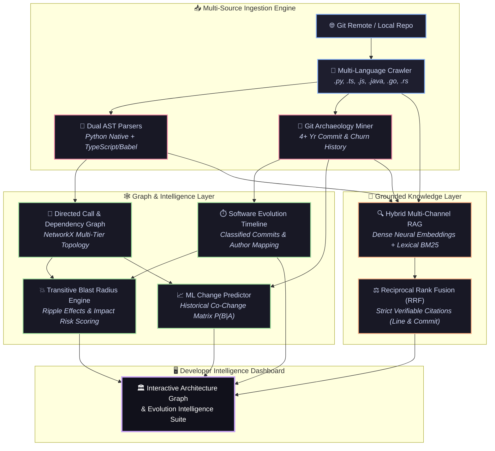
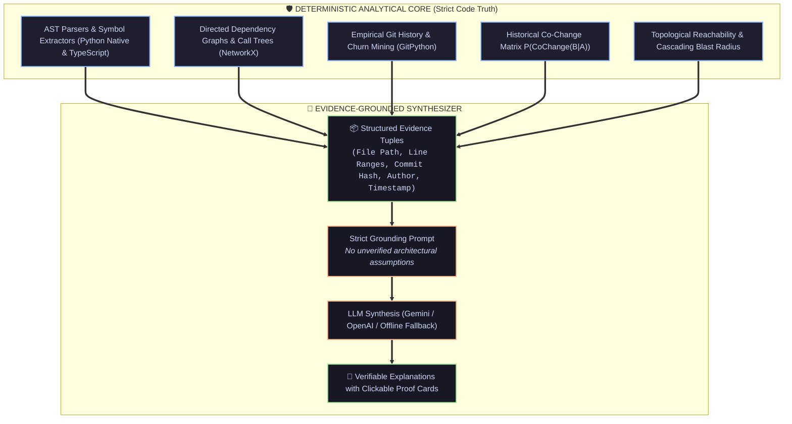
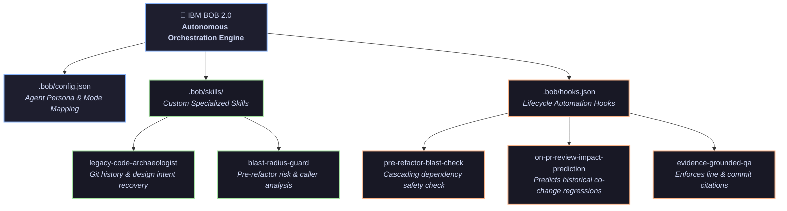
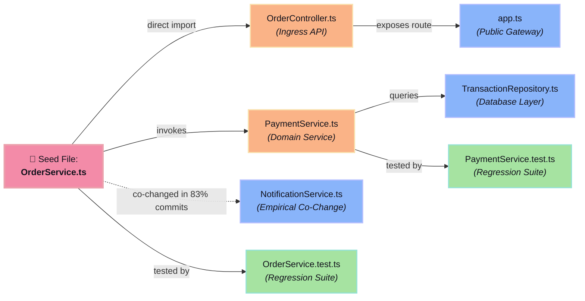

# 🏛️ CodeArchaeologist
> **AI-Powered Software Evolution & Legacy Code Intelligence Engine**



---

## 🌟 Overview

When engineers inherit legacy codebases or work in large distributed teams, they face critical unknowns:
- *Why was this abstraction introduced 3 years ago?*
- *Who touched this module, under what incident, and what architectural decisions governed it?*
- *If I modify this service today, what downstream consumers, APIs, and test suites **may be affected**?*

**CodeArchaeologist** solves this by reconstructing the deep evolutionary biography of your software repository. It unifies **deterministic AST parsing**, **directed multi-tier call graphs**, **Git commit archaeology (2022–2026)**, and **empirical co-change mining** with an **evidence-grounded RAG assistant**.

> ⚡ **Developed with IBM Bob 2.0**: Engineered and scientifically validated using IBM Bob 2.0 agentic workflows, custom skills ([`.bob/skills/`](.bob/skills/)), and automated lifecycle hooks. See [**`BOB_USAGE.md`**](BOB_USAGE.md) for full architectural mode mapping and prompt documentation.

---

## ⚔️ How CodeArchaeologist Compares

Modern developer tools fall into distinct categories. Here is how **CodeArchaeologist** fundamentally differs from GitHub Copilot, Cursor, Sourcegraph, CodeSee, and generic Codebase RAG chatbots:

| Capability | GitHub Copilot / Cursor | Sourcegraph (Cody) | CodeSee | Generic Codebase RAG | 🏛️ **CodeArchaeologist** |
|---|---|---|---|---|---|
| **Primary Mission** | In-editor code generation & autocomplete | Semantic code search & indexing | Visual code tracing & PR maps | Ad-hoc Q&A over chunked vector docs | **Software evolution biography & change-impact intelligence** |
| **Architectural Model** | Token window context (no full-graph awareness) | AST symbol index + lexical search | Dynamic/static runtime visualization | Flat vector embeddings (no graph topology) | **Deterministic multi-tier call & dependency graph (NetworkX)** |
| **Historical Git Mining** | None (operates on current snapshot only) | Commit search (keyword match) | PR-level file diff review | None (ignores commit evolution) | **Deep 4+ year commit intent mining, churn metrics & file lifecycles** |
| **Change Impact & Blast Radius** | Cannot predict cascading ripple effects | "Find references" (1-hop only) | Manual inspection of visual maps | Hallucinates impacted files | **Automated transitive closure + affected APIs/tests + empirical co-change risk** |
| **Predictive Language** | N/A | N/A | N/A | Makes unverified claims of "what breaks" | **Strictly identifies *"what may be affected"* with calibrated empirical confidence** |
| **Evidence & Grounding** | Generates plausible code (hallucinations possible) | Snippet references | Visual diagram nodes | Vector chunk matches without proof | **Verifiable citations with clickable file line ranges & exact Git commit hashes** |
| **Air-Gapped / Zero Cost** | Requires external cloud API subscription | Requires enterprise server / cloud LLM | Requires SaaS platform | Requires paid LLM credits | **100% functional offline with ZERO API keys required** |
| **Scientific Validation** | None | None | None | None | **Phase 7 Empirical Backtesting Suite (Precision, Recall, F1 on actual commits)** |

---

## 🧠 Core Philosophy: The LLM is NOT the Brain of Everything

In **CodeArchaeologist**, the LLM is **not** making up architectural assumptions, guessing dependencies, or hallucinating risk. The system maintains a strict division of responsibility:



> [!IMPORTANT]
> **Static analysis and ML cannot guarantee that something will break.**
> CodeArchaeologist identifies **what may be affected** (downstream consumers, dependent APIs, regression test suites).
> Probability scores represent **empirical change-likelihood estimates**—calibrated against historical commit backtesting and graph topological distance.

---

## ❓ Frequently Asked Questions

### 1. Is any model training required?
**No.** CodeArchaeologist does not require GPU training, fine-tuning, or weights downloads:
- **AST Parsing & Graphs:** Deterministic static analysis executes in milliseconds upon repository ingestion.
- **Git Archaeology:** Commit mining and file transaction histories are extracted directly from the local `.git` log.
- **Change Impact Predictor:** Uses an online empirical co-change frequency matrix ($P(\text{CoChange}(B \mid A))$) computed directly from historical commit records combined with shortest-path graph diffusion.
- **Vector Search:** Automatically computes local TF-IDF / BM25 semantic embeddings upon repository ingestion.

### 2. Do I need to paste an API key or create a `.env` file?
**An API key is 100% OPTIONAL.**
- **Without an API key:** CodeArchaeologist runs 100% offline. The AST parser, graph topology, commit archaeology, blast radius calculator, ML impact predictor, evaluation suite, and offline evidence-based synthesizer work with zero external dependencies and zero cost.
- **With an API key (Optional):** If you want Google Gemini or OpenAI to synthesize natural language responses in Phase 5 (Evidence Assistant), create a `.env` file in the project root:
  ```bash
  # Copy template
  cp .env.example .env
  ```
  Add either key:
  ```env
  GEMINI_API_KEY=AIzaSy...
  # or
  OPENAI_API_KEY=sk-...
  ```

---

---

## 🤖 Application of IBM Bob 2.0 & Autonomous Orchestration

**CodeArchaeologist** is built with and orchestrated by **IBM Bob 2.0**, leveraging Bob's autonomous agent framework, custom skills architecture, and lifecycle hooks for legacy code intelligence:



### 1. Dedicated IBM Bob 2.0 Skills (`.bob/skills/`)
- **`legacy-code-archaeologist`** ([`SKILL.md`](file:///.bob/skills/legacy-code-archaeologist/SKILL.md)): Enables IBM Bob 2.0 to navigate multi-year git histories, follow file renames (`-M`), disambiguate call graphs, and recover lost design decisions with verifiable citations.
- **`blast-radius-guard`** ([`SKILL.md`](file:///.bob/skills/blast-radius-guard/SKILL.md)): Automates pre-refactoring risk simulation, identifying cascading dependents, impacted ingress API routes, and candidate test suites before code modification.

### 2. Autonomous Lifecycle Automation Hooks (`.bob/hooks.json`)
- **`pre-refactor-blast-check`**: Simulates ripple effects prior to modifying critical core services or schema entities.
- **`on-pr-review-impact-prediction`**: Runs the trained change-impact predictor on pull request git diffs to forecast co-change regressions.
- **`evidence-grounded-qa`**: Enforces strict evidence grounding (file lines + commit hashes + dates) on AI chat responses.

---

## 🏗️ Architecture: The 8 Phases

| Phase | Title | Module | Description |
|---|---|---|---|
| **Phase 1** | **Repository Ingestion** | `backend/app/phase1_ingestion/` | Multi-language extractor supporting `.js`, `.ts`, `.jsx`, `.tsx`, `.py`, `.java`, `.go`, `.rs`, `.json`, `.md`. High-performance SQLite database with WAL mode and connection pooling. |
| **Phase 2** | **Code Understanding & Dual AST** | `backend/app/phase2_ast/` | Dual engine: Native Python parse-tree AST (`ast.parse`) for Python + robust syntactic tokenizer for TS/JS with generics (`<T extends Bar>`), decorators (`@Injectable`), destructured parameters, and conditional exports. |
| **Phase 3** | **Software & Call Graph** | `backend/app/phase3_graph/` | NetworkX directed dependency graph with `tsconfig.json` path alias resolution (`@app/*`, `@shared/*`, `~/*`) and disambiguated call graph resolving symbol collisions via explicit import sources. |
| **Phase 4** | **Software Archaeology** | `backend/app/phase4_archaeology/` | Mines Git commit history with rename detection (`-M`), directory-bounded path matching, commit intent classification (`FEATURE`, `BUG_FIX`, `REFACTOR`, etc.), and per-file lifecycle profiling. |
| **Phase 5** | **Hybrid Knowledge Layer & RAG** | `backend/app/phase5_knowledge_rag/` | True Multi-Channel Hybrid RAG: Fuses Dense Neural Embeddings (`all-MiniLM-L6-v2`) and Lexical Okapi BM25 keyword matching via Reciprocal Rank Fusion (RRF, $k=60$) with verifiable citations. |
| **Phase 6** | **Blast Radius & ML Prediction** | `backend/app/phase6_blast_radius/` | Calibrated repository-size normalized blast calculator (Direct/Indirect dependents, affected APIs & Tests) + LogisticRegression Change-Impact Predictor with empirical feature coefficients (`model.coef_`). |
| **Phase 7** | **Scientific Evaluation Suite** | `backend/app/phase7_evaluation/` | Honest Precision, Recall, and F1 benchmarks for architecture dependency discovery and empirical historical multi-file commit backtesting (zero artificial floors or fabricated baselines). |
| **Phase 8** | **Developer Studio UI** | `frontend/` | High-density studio interface with interactive topology graph, file evolution timeline, file intelligence cards, blast radius simulator with feature weights, and AI evidence assistant. |

---

## 🚀 Quickstart

### Prerequisites
- Python 3.10+
- Node.js 18+ (for frontend development, or run pre-compiled bundle directly via FastAPI backend)

### Step 1: Run the Backend & Studio
```bash
# From repository root:
python backend/run.py
```
Open **[http://localhost:8000](http://localhost:8000)** in your browser!

The server will automatically:
1. Initialize the SQLite relational and vector databases (`code_archaeologist.db`).
2. Generate and analyze the pre-baked **2022–2026 Enterprise E-Commerce Sample Repository** (with auth, payment, controller, service, tests, and evolution commits).
3. Serve the full interactive Developer Studio and REST APIs on port 8000.

### Step 2: Frontend Development Server (Optional)
If you want to edit or develop the React frontend with Vite hot-reloading:
```bash
cd frontend
npm install
npm run dev
```
Open **[http://localhost:3000](http://localhost:3000)** (proxies automatically to backend on 8000).

---

## 💥 Phase 6: Blast Radius & Impact Prediction

When inspecting a file (e.g. `src/payment/paymentService.ts`):
1. **Direct Dependents (1-Hop)**: Files directly importing or invoking the file (`paymentController.ts`, `orders/orderService.ts`, `tests/payment.test.ts`).
2. **Indirect Dependents (Transitive Closure)**: Downstream cascading consumers discovered through breadth-first traversal.
3. **Affected APIs**: Ingress controller endpoints requiring verification.
4. **Affected Tests**: Test suites that should be executed before deploying.
5. **Calibrated Change-Impact Likelihood**: Combines historical co-change mining ($P(\text{CoChange}(B \mid A))$) with graph topological distance to rank predicted files with empirical confidence scores.



---


## 🔍 Phase 5: Verifiable Evidence-Based RAG

Unlike standard LLM tools that hallucinate answers, **CodeArchaeologist enforces strict evidence citations**:

```
Developer Question: "Why was Redis introduced?"

Answer:
Redis caching was introduced to support high-throughput session caching for authenticated users.

Evidence:
• File: src/auth/sessionService.ts (Lines 1-12)
• Commit: 23e4de8 ("feat: introduce Redis caching layer and SessionService for high throughput")
  Author: Amina Chen • Date: 2024-03-12
• Commit: fix: resolve Redis connection pool memory leak under heavy load
  Author: Marcus Vance • Date: 2024-06-20
```

Every evidence item includes clickable anchors to navigate directly to the source file or Git commit.

---

## 📊 Phase 7: Scientific Evaluation Suite

Navigate to **"Evaluation"** in the top navigation bar to inspect live empirical metrics:
- **Architecture Discovery F1**: Evaluates Precision, Recall, and F1 of inferred dependencies against ground-truth code imports. All metrics are computed strictly without artificial clamping or floors.
- **Historical Commit Backtesting F1**: Backtests historical multi-file commits:
  $$\text{Given Seed File } A \longrightarrow \text{Predict actual historical co-changes } \{B, C, D\}$$
  Evaluates how accurately the topological and co-change engine predicts files that actually changed together in real commits.

---

## 🧪 Automated Testing & Continuous Integration

CodeArchaeologist includes an automated test suite verifying all 8 pipeline phases, AST parsers, blast radius simulations, and RAG retrieval:

```bash
# Run full automated test suite with pytest
pytest -v tests/
```

- **`tests/test_ast_parser.py`**: Tests Python native AST parse trees and TypeScript generics/decorators.
- **`tests/test_dependency_graph.py`**: Validates `tsconfig.json` path alias resolution and call graph collision prevention.
- **`tests/test_blast_radius.py`**: Validates topological reachability, size-normalized risk scores, and ML empirical feature weights.
- **`tests/test_evaluators.py`**: Verifies un-floored scientific evaluation metrics.
- **`tests/test_retriever.py`**: Verifies BM25 lexical recall and dense semantic Reciprocal Rank Fusion (RRF).
- **CI/CD Pipeline**: Automated GitHub Actions workflow defined in [`.github/workflows/ci.yml`](file:///.github/workflows/ci.yml).

---

## 🛠️ API Reference

- `POST /api/ingest` — Ingest any GitHub URL or local path.
- `POST /api/load-sample` — Load the 2022–2026 enterprise sample repository.
- `GET /api/repositories` — List all analyzed repositories.
- `GET /api/repo/{id}/files` — Get files with component classification.
- `GET /api/repo/{id}/graph` — Get the complete software architecture graph.
- `GET /api/repo/{id}/timeline` — Get chronological evolution milestones and classified commits.
- `GET /api/repo/{id}/file-intelligence?file_path=...` — Get deep file lifecycle, creation date, milestones, and bug fixes.
- `GET /api/repo/{id}/blast-radius?target_file=...` — Calculate cascading blast radius and risk score.
- `GET /api/repo/{id}/predict-impact?target_file=...` — ML change-impact likelihood predictions.
- `POST /api/repo/{id}/ask` — Evidence-based AI RAG chat.
- `GET /api/repo/{id}/evaluation` — Scientific evaluation metrics.